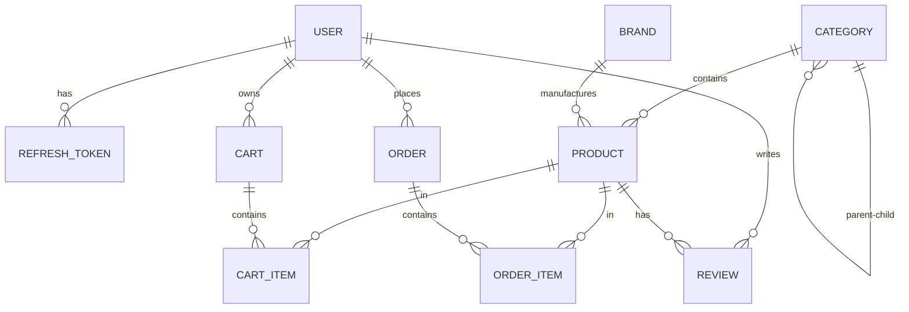

# Eshop Project: Comprehensive Architectural & Database Analysis

This document provides a detailed overview of your e-commerce repository's architecture, maps out all database models and relationships, outlines a recommended frontend architecture using Next.js, and lists the exact things you will need to implement a frontend client.


---

## 1. Current Backend Architecture

Your backend is a highly modular, type-safe, and production-ready **GraphQL API** built using a clean architectural style.

### Key Backend Technologies
- **Application Server:** **Express** serving as the middleware host for HTTP requests and WebSocket connections.
- **GraphQL Engine:** **Apollo Server v4** combined with **Type-GraphQL** for code-first schema definitions, validation (`class-validator`), and runtime checking.
- **ORM & Database:** **Sequelize** running on PostgreSQL (local or hosted via **Supabase**). The migration scripts reside under the `supabase/migrations` folder.
- **Security & Performance:** Customized Apollo Plugins (`src/apollo-plugins.ts`) implementing:
  - Query Depth Limiting (stops nested resolver attacks).
  - Rate Limiting.
  - Security Headers.
  - Logging & Error Formatting.
- **Caching & PubSub:** **Redis** connection configuration is ready (`ioredis`). In-memory `PubSub` is currently configured for WebSockets subscriptions (`src/index.ts`).

### Directory Layout & Vertical Slicing
The application uses a **domain-driven modular architecture** under `src/modules`. Each domain operates as a vertical slice:

```
src/
├── config/                  # Configuration validation using Zod
├── graphql/                 # Global resolvers (e.g. cart.resolver.ts, order.resolver.ts)
├── modules/                 # Modular Business Domains
│   ├── auth/                # Authentication, Token refresh, Cryptography, User profiles
│   ├── cart/                # Cart line manipulation, pricing, session-based carting
│   ├── order/               # Order lifecycle logic, checkout workflows
│   └── product/             # Catalog management (Product, Brand, Category)
├── shared/                  # Common utilities, models, db connections, custom scalars
│   ├── graphql/             # GraphQL Context, Errors, Scalars (DateTime, JSON)
│   └── infrastructure/      # DB Connection, models.ts, Redis connections, Pino Logger
└── index.ts                 # Main server entrypoint (HTTP + WebSockets setup)
```

---

## 2. Database Models and Schema Map

Your database is structured around the relational models defined in `src/shared/infrastructure/database/models.ts`. 



### Table Breakdown

| Model (`Class`) | Table Name | Purpose | Primary Keys & Essential Fields | Relationships |
| :--- | :--- | :--- | :--- | :--- |
| **`User`** | `users` | Store customers, managers, and administrators. | `id` (UUID), `email` (Unique), `role` (`admin`/`manager`/`customer`), `permissions` (text array), `firstName`, `lastName`, `isActive`, `emailVerified` | Has many `RefreshToken`, `Order`, `Cart`, `Review` |
| **`AuthUser`** | `auth.users` | Secure credentials (passwords). Resides in Supabase-like `auth` schema. | `id` (UUID), `email` (Unique), `encryptedPassword` (bcrypt hash) | Maps 1:1 with `User` on `id` |
| **`RefreshToken`**| `refresh_tokens`| Keeps track of active login sessions and JWT rotation hashes. | `id`, `userId` (FK), `tokenHash`, `expiresAt`, `revoked` | Belongs to `User` |
| **`Category`** | `categories` | Product classification folders. | `id`, `name`, `slug` (Unique), `parentId` (FK, self-referencing), `isActive`, `sortOrder`, SEO tags | Belongs to parent `Category`, Has many children `Category` & `Product` |
| **`Brand`** | `brands` | Manufacturers/Brands of products. | `id`, `name`, `slug` (Unique), `logoUrl`, `isActive` | Has many `Product` |
| **`Product`** | `products` | E-commerce items/SKUs. | `id`, `name`, `slug`, `sku` (Unique), `price` (Decimal), `compareAtPrice`, `categoryId` (FK), `brandId` (FK), `images` (JSONB Array), `dimensions` (JSONB) | Belongs to `Category`, `Brand`; Has many `CartItem`, `OrderItem`, `Review` |
| **`Cart`** | `carts` | Shopping carts for logged-in users or guest sessions. | `id`, `userId` (FK, Nullable), `sessionId` (Nullable), `subtotal`, `discountAmount`, `taxAmount`, `total`, `currency` | Belongs to `User`, Has many `CartItem` |
| **`CartItem`** | `cart_items` | Specific quantities of a product in a cart. | `id`, `cartId` (FK), `productId` (FK), `quantity`, `unitPrice`, `totalPrice` | Belongs to `Cart`, `Product` |
| **`Order`** | `orders` | Completed checkouts. | `id`, `orderNumber` (Unique), `userId` (FK), `status` (`pending`, `confirmed`, `processing`, `shipped`, `delivered`, `cancelled`, `refunded`), `subtotal`, `total`, `shippingAddress` (JSONB), `billingAddress` (JSONB) | Belongs to `User`, Has many `OrderItem` |
| **`OrderItem`** | `order_items` | Price/SKU static snap-shots of purchased items in an order. | `id`, `orderId` (FK), `productId` (FK, Nullable), `productName`, `productSku`, `quantity`, `unitPrice`, `totalPrice` | Belongs to `Order`, `Product` |
| **`Review`** | `reviews` | Product ratings and reviews. | `id`, `productId` (FK), `userId` (FK), `rating` (Integer), `title`, `comment`, `isVerifiedPurchase`, `isApproved`, `helpfulVotes` | Belongs to `Product`, `User` |

---

## 3. Recommended Frontend Architecture (Next.js)

To consume this GraphQL API, a **Next.js (App Router)** frontend is highly recommended because it offers excellent SEO, speed (SSG/ISR for Product catalog pages), and React Server Components (RSC) to query metadata efficiently.

### Frontend Tech Stack Proposed:
1. **Core Framework:** Next.js 14+ (App Router) with TypeScript.
2. **GraphQL Client:**
   - **For Server Components & Mutations:** `@apollo/client` (using their experimental RSC support) OR standard `fetch` queries.
   - **For Client Components (real-time subscriptions):** `@apollo/client` (WebSocket connection via `graphql-ws`).
3. **Type Safety & Code Generation:** `@graphql-codegen/cli` with `@graphql-codegen/client-preset`. This compiles backend types and your frontend `.graphql` operations into fully-typed react-hooks or documents automatically.
4. **Styling:** CSS Modules or Vanilla CSS (standard theme tokens mapping colors, spacing, and dark/light modes).

```
Next.js Client App Layout
├── src/
│   ├── app/                      # App Router Pages
│   │   ├── (auth)/               # Login / Register routes
│   │   ├── catalog/              # Products catalog (Static Pages with Revalidation)
│   │   │   └── [slug]/           # Dynamic product details page
│   │   ├── cart/                 # Interactive client cart page
│   │   ├── checkout/             # Order placement form
│   │   └── orders/               # User order history (Protected / auth required)
│   ├── components/               # Shared components (Button, Input, Card, Navbar)
│   ├── graphql/                  # Client operations (.graphql files: queries, mutations, subscriptions)
│   │   └── __generated__/        # Auto-generated Typescript types (via codegen)
│   ├── hooks/                    # Reusable React Hooks (e.g. useAuth, useCart)
│   └── lib/                      # Apollo Client / fetch configs, cookie helpers
```

---

## 4. Things You Need to Implement Next (Next Steps)

If you are setting up the frontend, here is what you need to install, build, and configure:

### Step 1: Export the GraphQL Schema
To enable full type-safety on the frontend, compile the backend schema into a `schema.graphql` file.
1. Run the backend in development mode (`npm run dev`) with `NODE_ENV=development`.
2. The schema file will automatically generate in the root or `src/` directory (controlled by `emitSchemaFile` in `src/schema.ts`).

### Step 2: Initialize Next.js Project
Create a new Next.js client inside your workspace (or in a sibling directory):
```bash
npx create-next-app@latest frontend --typescript --eslint --use-npm --src-dir --app
```

### Step 3: Install Core Frontend Dependencies
Inside the new `frontend/` directory, install:
```bash
npm install @apollo/client graphql graphql-ws
npm install -D @graphql-codegen/cli @graphql-codegen/client-preset
```

### Step 4: Configure GraphQL Code Generator
Create a `codegen.ts` file in the frontend to compile your GraphQL queries and mutations into TypeScript types:
```typescript
import type { CodegenConfig } from '@graphql-codegen/cli';

const config: CodegenConfig = {
  overwrite: true,
  schema: "http://localhost:4000/graphql", // Your running backend
  documents: "src/graphql/**/*.graphql",   // Where you'll place queries
  generates: {
    "src/graphql/__generated__/": {
      preset: "client",
      plugins: []
    }
  }
};

export default config;
```

### Step 5: Implement Authentication Synchronization
Your backend issues short-lived JWT `accessToken` (15m expiration) and long-lived `refreshToken` (7d).
- **Client Cookie Strategy:** Save the `refreshToken` in a secure, HTTP-only cookie.
- **Bearer Header:** Provide the `accessToken` in the `Authorization` header (`Bearer <token>`) for authenticated resolvers like `me`, `addToCart`, and `createOrder`.
- **Silent Refresh:** When a request returns a `TOKEN_EXPIRED` error (or client-side timer fires), call the `refreshToken` mutation using the stored token to get a new `accessToken` without interrupting the user.
